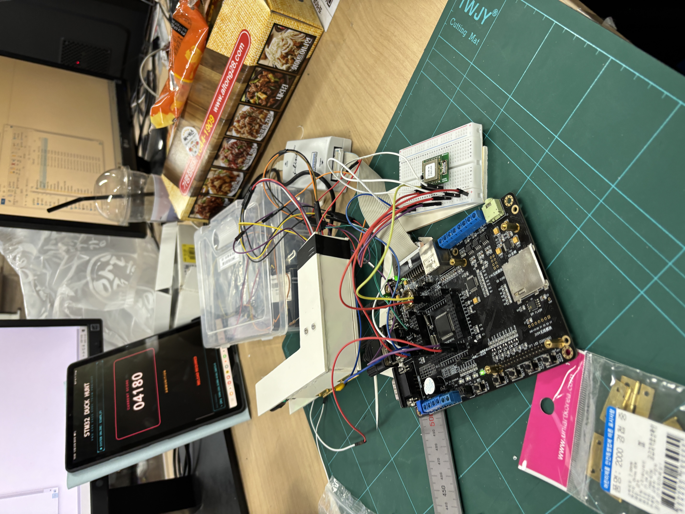

# 🦆 2025학년도 임베디드시스템설계및실험 텀 프로젝트

***센서 기반 레트로 오리 사냥 게임***

[부산대학교 정보컴퓨터공학부](https://cse.pusan.ac.kr/cse/index.do)

## 🎮 프로젝트 소개

- STM32 기반 실습용 임베디드 보드 상에서, 레트로 게임 Duck Hunt를 구현하는 것을 목표로 합니다

*작성중*

## 🛠️ 기술 스택

*추가 예정*

## 🖥️ 시스템 아키텍처

*추가 예정*
