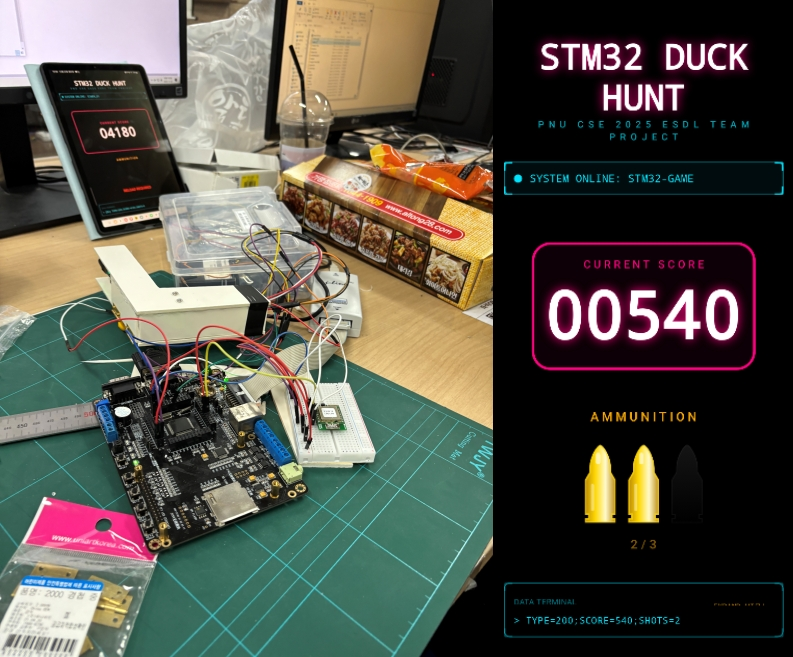
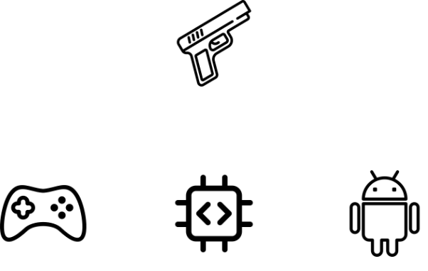

# 🦆 2025학년도 임베디드시스템설계및실험 텀 프로젝트

***센서 기반 레트로 오리 사냥 게임***

수요일(004) 1조

김한솔, 정유진, 송승우, 장민준

[부산대학교 정보컴퓨터공학부](https://cse.pusan.ac.kr/cse/index.do)

## 🎮 프로젝트 소개

- 과거 컴퓨팅 자원이 한정적이던 시절, 현대 MCU 수준의 가벼운 하드웨어 장비를 창의적으로 활용하여 광전자식 HIT 판정을 구현한 [게임 개발 사례](https://en.wikipedia.org/wiki/Duck_Hunt)에 영감을 받아 시작되었습니다.

- 조도 센서 기반 HIT 판정을 포함하는 레트로 게임 Duck Hunt를 구현하면서, MCU 기반 개발 보드(하드웨어 / 펌웨어), PC 소프트웨어, 모바일 어플리케이션이 하나의 시스템 내에 연동되도록 구현하여, 센서 데이터 수집, 실시간 처리, 통신 중계, 게임 로직 반영에 이르는 End-to-end 아키텍처를 구현하는 것을 목표로 합니다.

## 🛠️ 기술 스택

### MCU 기반 개발 보드

- STM32F107VC(72MHz ARM Cortex-M3) 기반

- 조도 센서 및 터치 센서(트리거) 포함

### 게임

- Unity(2D) 기반

- 시리얼 통신을 위한 .NET Framework `System.IO.Ports` 플러그인 포함

### 모바일 어플리케이션

- Android 기반

- 블루투스 통신 기능 포함

## 🖥️ 시스템 아키텍처

- 동작 구조

    1. 컨트롤러의 터치 센서(트리거) 입력 시 현재 조도 센서의 값을 PC 게임으로 송신

    2. 게임 화면이 일시적으로 반전되면서 히트 박스에 해당하는 부분을 제외한 모든 부분을 암전

    3. 특정 시간(120ms) 동안 컨트롤러의 조도 센서 값을 수집하여 Peak 값을 PC 게임으로 송신

    4. 게임에서 초기 조도 센서 값과 테스트 조도 센서의 값 차이를 파악하여 해당 값이 임계값을 넘으면 HIT, 넘지 못하면 Miss 판정

    5. 주기적(0.5s)으로 PC 게임에서 임베디드 보드를 경유하여 블루투스를 통해 모바일 앱으로 점수 및 잔탄 수 정보 송신
