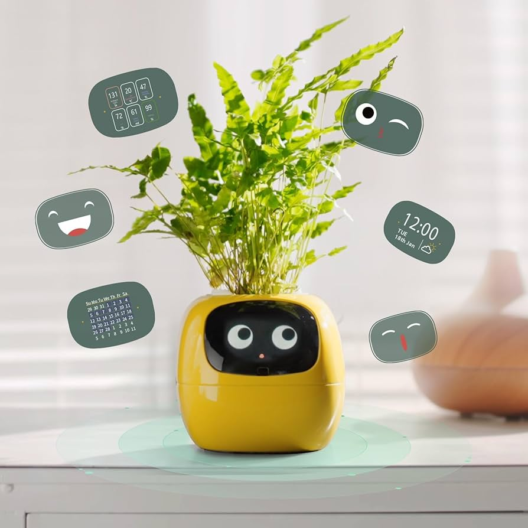
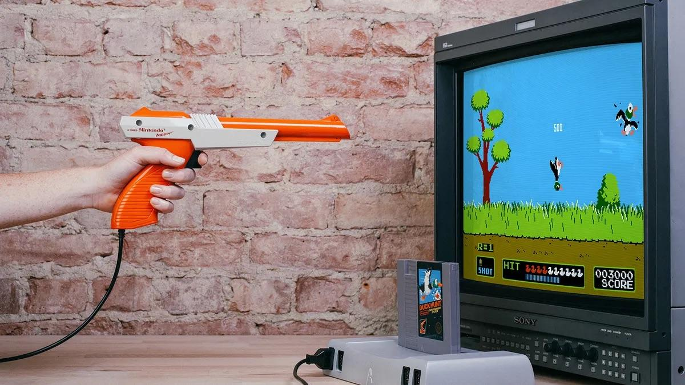
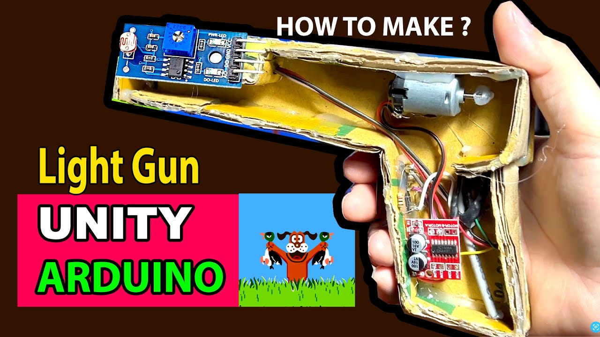

# 프로젝트 주제 제안

## 1. 지능형 스마트 화분 시스템

- 예시

- Arduino 구현 예시

### 목적

소형 화분 환경을 자동 감시 / 제어하고, 수집된 데이터를 바탕으로 TinyML을 이용해 식물의 상태를 지능적으로 판별한다.

또한 TFT LCD를 통해 식물의 상태를 실시간으로 표현하여, 사용자는 별도의 조작 없이 화분의 건강 상태를 직관적으로 파악할 수 있도록 한다.

추가로, Bluetooth / 네트워크 기능을 추가를 통해 스마트폰과 연동하여 화분의 상태를 확인 / 관리할 수 있도록 한다.

### 내용

STM32F107 마이크로컨트롤러를 중심으로, 환경 센서(온습도, 조도, 토양 수분)를 주기적으로 측정하고, TinyML 모델을 통해 정상 / 주의 / 위험 상태를 분류한다.

판단 결과는 TFT LCD에 실시간으로 표시되며, 토양 수분이 부족한 경우 펌프를 통한 자동 급수와 조도가 낮을 경우 LED의 자동 점등을 통해 보조광을 제공한다.

| 기능 | 설명 |
|------|------|
| 환경 모니터링 | 온습도, 조도, 토양 수분을 주기적으로 측정 |
| TinyML 이상 탐지 | 센서 데이터를 기반으로 식물 상태(정상/주의/위험) 분류 |
| LED 색상/밝기 제어(선택) | NeoPixel을 이용해 상태를 시각적으로 표현(초록 = 정상, 주황 = 주의, 빨강 = 위험) |
| 자동 급수 제어 | 토양 수분이 일정 이하일 때 펌프 구동 |
| 자동 조명 제어 | 광량이 부족할 때 LED 자동 점등 |

- TinyML 처리 흐름

    1. 센서 데이터 수집

    2. 데이터 정규화 후 평균값 및 변화율 계산

    3. 학습된 TinyML 모델(MLP 등)을 이용하여 추론

    4. 상태값(0 ~ 2) 출력

    5. LED / 펌프 동작 제어 로직에 반영

### 사용 센서

| 종류 | 설명 |
|------|------|
| 온습도 센서 | DHT22 등 |
| 조도 센서 | BH1750 등 |
| 토양습도 센서 | SEN030003 등 |

### 시나리오

1. 환경이 정상(온습도 / 광량 적절)

   TinyML이 정상 판정 -> LCD에 정상 환경임을 표시

2. 주의 및 위험 상태

    1. 조도 부족(밤)

       주의 상태로 전환 및 LED 자동 점등, LCD에 조명 필요 등의 메시지

    2. 토양 수분 부족

       위험 상태로 전환 및 펌프 자동 구동

3. 조명 조절 및 자동 급수 후

   상태 정상화 -> LCD 정상 상태로 복귀

4. Bluetooth 모듈을 통한 스마트폰 제어

   스마트폰을 통해 화분의 실시간 상태 및 수동 제어

## 2. 센서 기반 레트로 오리사냥 게임

- 원본 게임

- Arduino 광총 구현 예시

### 목적

STM32F107 마이크로컨트롤러를 이용하여 센서 간 협력 기반의 실시간 슈팅 게임을 구현한다. TFT LCD(또는 일반 모니터)를 이용해 *NES*의 *Duck Hunt*와 유사한 슈팅 게임을 구성하고, 조도 센서와 거리 센서를 결합하여 사격 환경에 따라 판정을 수행하는 구조를 설계한다.

또한 Bluetooth 통신을 통해 스마트폰 앱과 연동하여 점수, 명중률, 거리 정보 등의 데이터를 실시간으로 전송하고, 앱에서 난이도 조정이나 감도 설정을 원격으로 수행할 수 있도록 한다.

(게임 자체를 앱에서 구현 시) Bluetooth 통신을 통해 실제 게임을 구동하는 앱과 입력을 동원하는 임베디드 기기 간 연결을 수행

### 내용

STM32F107 마이크로컨트롤러를 중심으로 TFT LCD(또는 컴퓨터 모니터) 화면의 빛을 감지하여 명중 여부를 판단하고, 거리 센서를 통해 화면과 플레이어 간 거리를 측정한다. 거리 측정값은 조도 센서의 명중 임계값을 동적 조정 및 치팅 방지에 활용한다.

사격 결과는 화면에 표시되며, 그 기록은 Bluetooth 모듈을 통하여 스마트폰 앱으로 전송된다. 앱에서는 점수판, 거리 그래프, 명중률 통계 등을 시각화하고 게임 난이도나 임계값 보정 계수를 다시 임베디드 기기로 송신할 수 있다.

| 기능 | 설명 |
|------|------|
| 조도 센서 기반 사격 판정 | 트리거 버튼을 누르면 화면의 히트 박스에 해당하는 부분이 순간적으로 플래시되며 조도 센서에서 빛을 감지 |
| 거리 기반 감도 조정 / 치팅 방지 | 거리 센서로 측정한 거리값에 따라 명중 임계 광량을 실시간으로 조절 및 치팅 방지 |
| LCD 그래픽 표시 | 오리의 이동, 시간 및 명중 표시 등 |
| Bluetooth 연동 | 점수, 거리, 명중률 등을 전송하여 앱에서 난이도 및 감도 설정 |
| LED / 부저 피드백 | 명중시 LED 점멸 또는 효과음 재생 |

- 동작 흐름

1. 거리 및 환경 조도 측정

   특정 시간마다 거리 값 및 베이스가 될 환경의 조도를 읽음

2. 조도 센서 감도 및 판정 조정

   읽은 데이터를 이용하여 임계값(예: 기준값 + a * 거리(a = 보정 계수) - 환경 조도 등) 설정

3. 트리거 입력 시 사격 시퀀스 실행

   화면에 흰색 플래시(매우 짧은 시간)를 켜면서 광총의 조도 센서 측정 시작

   측정값이 임계값 초과 시 HIT, 아니면 MISS

4. 결과 표시

   화면에 명중 여부 표시 및 LED / 부저 효과

5. Bluetooth 통신

   점수, 거리, 밝기 등의 데이터 전송

   앱에서 시각화 및 피드백 / 설정 조정

### 사용 센서

| 종류 | 설명 |
|------|------|
| 조도 센서 | SZH-SSBH-011 등 |
| 거리 센서 | SZH-USBC-004 등 |

### 시나리오

1. 시스템 전원 인가

   화면에 타이틀 및 Bluetooth 연결 정보 표시

2. 앱과 기기 연결

3. 플레이어 위치 조정

4. 게임 시작

5. 트리거 버튼 입력

6. 거리 및 조도 기반 판정

    1. 명중 시

       화면에 HIT 표시 후 점수 +1, LED / 부저 효과

    2. 실패 시

       화면에 MISS 표시, LED / 부저 효과

7. Bluetooth로 결과 전송

---

*본 문서에 사용된 이미지는 라이선스 생각 안하고 그냥 뽀려 온 것임*
