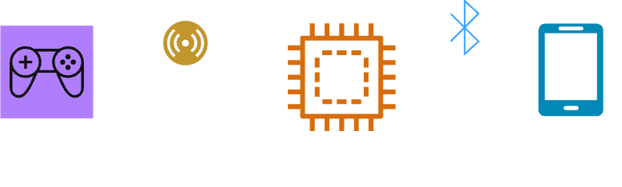

# 프로젝트 구체화




## 통신 프로토콜 명세

1. STM32: 광총에서 트리거 발생 시 STM32에서 아래의 세가지 정보를 수집하여 PC로 시리얼 통신으로 전송

    - 메시지 종류 정보: `TRIG`

    - 시퀀스 정보(몇 번째 사격인지): `seq=23`(23번째 사격)

        - 실시간 환경에서는 여러 통신이 중간에 꼬일 수 있기 때문에 필요

    - 현재 조도: `ambient=928`

    - (향후 필요 시) 거리 정보: `distance=0.63`

    - 전체 메시지 예시: `TRIG,seq=23,ambient=928`

2. PC: 정보 수신 즉시 ACK 송신 후, 다음 프레임부터 40ms동안 화면 플래시 시작

    - 메시지 종류 정보: `ACK`

    - 시퀀스 정보: `seq=23`

    - 전체 메시지 예시: `ACK,seq=23`

3. STM32: ACK 수신 시점을 기준으로 120 ms 동안 밝기 정보 샘플링

   샘플링 종료 후 peak, hit 정보를 PC로 전달

    - 메시지 종류 정보: `RESULT`

    - 시퀀스 정보: `seq=23`

    - 최고 밝기 정보: `peak=234`

        - 조도 센서 값은 낮을 수록 밝은 값이기 때문에 제일 낮은 값으로 계산

    - 명중 정보: `hit=1`

    - 전체 메시지 예시: `RESULT,seq=23,peak=234,hit=1`

4. PC: 주기적(0.5 ~ 1초 단위)으로 점수나 진행 시간 정보를 전송

    - 메시지 종류 정보: `STATUS`

    - 점수 정보: `score=20`

    - 시간 정보: `time=3`

    - 전체 메시지 예시: `STATUS,score=20,time=3`


## 구현 명세

- **임베디드 시스템**

    - **소프트웨어**

        1. 조도 센서 실시간 샘플링(ADC + DMA): 조도 센서를 지속적으로 연속 샘플링하며, DMA를 통해 버퍼에 저장

          ```C
          // 예시 코드(AI로 생성한거라 정확하지 않을 수 있음)

          #define ADC_BUF_LEN 512

          uint16_t adc_buf[ADC_BUF_LEN];

          void ADC_DMA_Config(void) {
              ADC_InitTypeDef ADC_InitStructure;
              DMA_InitTypeDef DMA_InitStructure;

              RCC_AHBPeriphClockCmd(RCC_AHBPeriph_DMA1, ENABLE);
              RCC_APB2PeriphClockCmd(RCC_APB2Periph_ADC1, ENABLE);

              // DMA 설정
              DMA_DeInit(DMA1_Channel1);
              DMA_InitStructure.DMA_PeripheralBaseAddr = (uint32_t)&ADC1->DR;
              DMA_InitStructure.DMA_MemoryBaseAddr = (uint32_t)adc_buf;
              DMA_InitStructure.DMA_DIR = DMA_DIR_PeripheralSRC;
              DMA_InitStructure.DMA_BufferSize = ADC_BUF_LEN;
              DMA_InitStructure.DMA_PeripheralInc = DMA_PeripheralInc_Disable;
              DMA_InitStructure.DMA_MemoryInc = DMA_MemoryInc_Enable;
              DMA_InitStructure.DMA_PeripheralDataSize = DMA_PeripheralDataSize_HalfWord;
              DMA_InitStructure.DMA_MemoryDataSize = DMA_MemoryDataSize_HalfWord;
              DMA_InitStructure.DMA_Mode = DMA_Mode_Circular; // Circular 모드를 통해 버퍼를 계속 채우도록 설정
              DMA_InitStructure.DMA_Priority = DMA_Priority_High;
              DMA_Init(DMA1_Channel1, &DMA_InitStructure);
              DMA_Cmd(DMA1_Channel1, ENABLE);

              // ADC 설정
              ADC_InitStructure.ADC_Mode = ADC_Mode_Independent;
              ADC_InitStructure.ADC_ScanConvMode = DISABLE;
              ADC_InitStructure.ADC_ContinuousConvMode = ENABLE;
              ADC_InitStructure.ADC_ExternalTrigConv = ADC_ExternalTrigConv_None;
              ADC_InitStructure.ADC_DataAlign = ADC_DataAlign_Right;
              ADC_InitStructure.ADC_NbrOfChannel = 1;
              ADC_Init(ADC1, &ADC_InitStructure);

              // 7.5 사이클마다 샘플링
              ADC_RegularChannelConfig(ADC1, ADC_Channel_0, 1, ADC_SampleTime_7Cycles5);

              ADC_DMACmd(ADC1, ENABLE);
              ADC_Cmd(ADC1, ENABLE);
              ADC_SoftwareStartConvCmd(ADC1, ENABLE);
          }
          ```
            - CPU 개입 없이 계속해서 최신 조도 값을 버퍼에 저장

            - 트리거 시 별도의 ADC 호출은 없이, 버퍼에서 현재값이나 평균값을 계산하여 `ambient` 값으로 사용

        2. 트리거 입력 처리

            - 트리거 버튼 인터럽트 발생

            - DMA 버퍼 최종 인덱스에서 현재 `ambient` 조도값 읽기

            - 거리 센서값 필요 시 함께 측정

            - `seq` 값 증가

            - PC로 `TRIG` 메시지 전송

        3. `ACK` 수신 후 샘플링 윈도우 시작

           ACK 수신 시각 = t0
           샘플링 윈도우 = 120 ms

            - DMA는 계속해서 최신 조도값을 버퍼에 기록

            - MCU는 W ms가 지난 시점에서 DMA 버퍼에서 t0 ~ t0 + W까지의 샘플들의 `peak` 분석

              ```C
              uint16_t end = adc_get_write_index();
              uint16_t start = (end + ADC_BUF_LEN - N_SAMPLES) % ADC_BUF_LEN;

              uint16_t peak = 4095;
              for (int i = 0; i < N_SAMPLES; ++i) {
                  uint16_t v = adc_buf[(start + i) % ADC_BUF_LEN];
                  if (v < peak) peak = v;  // ADC 값 낮을 수록 밝기 높음
              }
              ```

        4. `RESULT` 메시지 전송

            - 임계값과 비교하여 `hit` 결정

            - 해당 정보를 PC로 송신

        5. PC로부터 주기적으로 `STATUS` 정보가 들어올 때마다 이를 블루투스 앱으로 전달

    - **하드웨어**

        - 트리거 스위치(터치 센서): 사용자가 격발 시 입력되는 디지털 신호로, STM32에서 인터럽트 외부 입력(EXTI)으로 처리

            - 트리거가 발생하면 소프트웨어 쪽에서 즉시 `TRIG` 메시지를 보내게 됨

            - 터치 센서 자체가 이미 저항 처리가 되어 있어서 그냥 연결만 하면 될 듯

            1. 사용자가 트리거를 터치

            2. 터치 센서 모듈 OUT 핀 HIGH

            3. STM32 GPIO 인터럽트 발생

            4. 인터럽트 핸들러에서 진동 모터 ON + `TRIG` 메시지 송신

                - 인터럽트 핸들러에서 바로 불러다 쓸 수 있도록 모터를 제어하는 함수를 따로 만들어 주면 좋을 듯!

- **게임**

    1. `SerialManager`

        - STM32와 시리얼 통신 전담

        - 별도 스레드에서 수신, 메인 스레드에서 큐를 통해 입력 처리

        - `TRIG`, `RESULT` 메시지 파싱 후 `GameManager`로 전달

        - `ACK` 메시지를 STM32로 전송

    2. `GameManager`

        - 게임 상태 관리

        - 타겟 스폰, 이동, 라운드 진행 로직 관리

        - `SerialManager`로부터 `TRIG` 수신 후 화면 플래시 처리

            - 타겟 스프라이트 표시 및 숨김, 피격 애니메이션 재생

        - `RESULT` 수신 후 명중 및 실패 판정을 게임에 반영


- **블루투스 앱**

    - 게임과 관련한 UI는 모두 블루투스 앱에서 처리함

    - 블루투스로 송신한 `STATUS` 메시지를 파싱하여 화면에 표시
